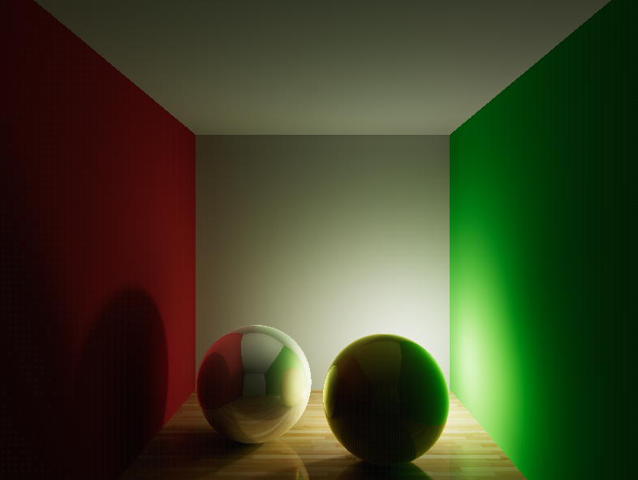
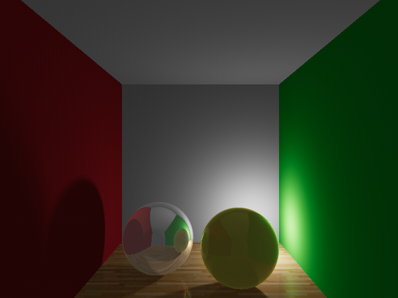

# LumenRay
A Real Time Ray Tracing Engine written in Rust.

This project uses compute shaders to ray trace a schene in real time on the GPU. The difference beween this project, and other ray tracers, is the cached global illumination. 

### Global Illumination
Each object has a light map which stores the indirect illumination on the object. When this map is updated, the illumination from all other objects is calculated, and stored. This map depends on the scene, and does not change when the camera moves, so does not need to be re-calculated on every frame, instead, it can be updated when the scene updates. This is a large performance gain, as ray-traced global illumination is far more costly than calculating direct illumination. This allows for a much higher frame rate and ray-tracing quality scenes in real time on hardware that would otherwise not be able to.

**Without Global Illumination**

# Controls
Move around the scene using WASD, uncapture the mouse using the Escape key.

# Running
A `.zip` is provided in Releases, extract and run `lumen_ray.exe`.

# Building From Source
Currently only tested on Windows 10/11, with an Nvidia GPU.

* Install cargo/rustup.
* `cargo run -r`

# Roadmap
* radiosity
* Use a BVH (AABB) for ray traversal
* support for meshes and loading from .obj or using assimp
* implement many post processing effects in shaders (depth of field, bloom, material roughness, fog, volumetric lighting, glare)
* PBR
* faster radiosity
* refraction
* photon mapping?
* ImGUI
* different types of renderers to support a compute based ray engine, CPU based, and vk ray tracing pipeline based (ComputeRenderer,CPUStreamingRenderer,AcceleratedRenderer)
* Scene serialize/deserialize (maybe into yaml/toml)
* physics
* rasterised particles? using z buffer?